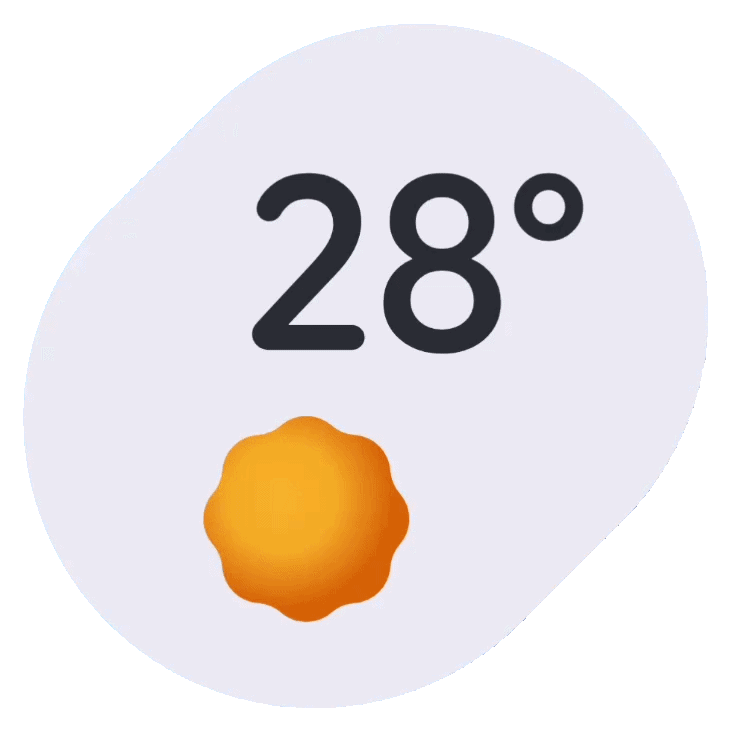

# Material Not You Widgets

Yes, it says Material **NOT** You. No, these are not _your_ widgets. They're **MINE** 😈.

## Features

- **Zero Tolerance for Bad UI**  
  Supports Material You theming not because it cares about you, but because it respects itself.

- **Zero Permissions You Don't Need**  
  Internet. Foreground service. Boot completed. That's it.

- **Zero Information Shared**  
  Except the one you give it, duh...

- **Zero Bitches**  
  😔

## Widgets

### 1. Weather (Pill)

A weather widget that looks good because it refuses not to.

#### Features

- **Dual Providers**  
  Choose between [MET Norway](https://api.met.no/weatherapi/) or [Open-Meteo](https://open-meteo.com/). Both are free. Neither will sell your data. I checked.

- **Morphing Animation Engine**  
  Tap to refresh and watch the pill morph into a 6-lobed clover, spin around like it's having a seizure, then morph back. Built with raw `Canvas`, `Choreographer`, and a concerning amount of parametric math. Animations run as a foreground service because Android doesn't let you do jack in the background anymore.

### 2. _Soon™_

## Compatibility

- **Android 12+** (SDK 31) — I'm not supporting your Galaxy S7
- Jailbroken Rabbit R1 — probably fine
- "Custom ROMs" — you can figure this shit out

## License

Do whatever you want, just don't blame me when it inevitably goes wrong (AKA [GNU General Public License v3](LICENSE)).
